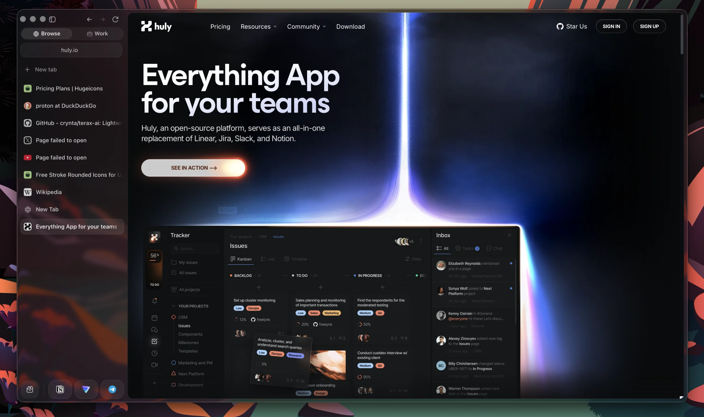
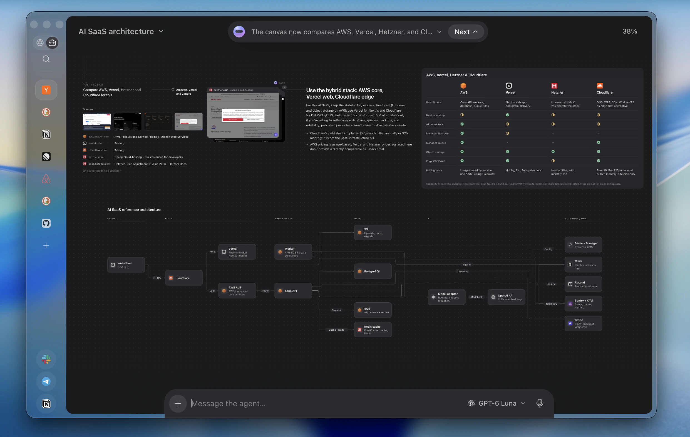
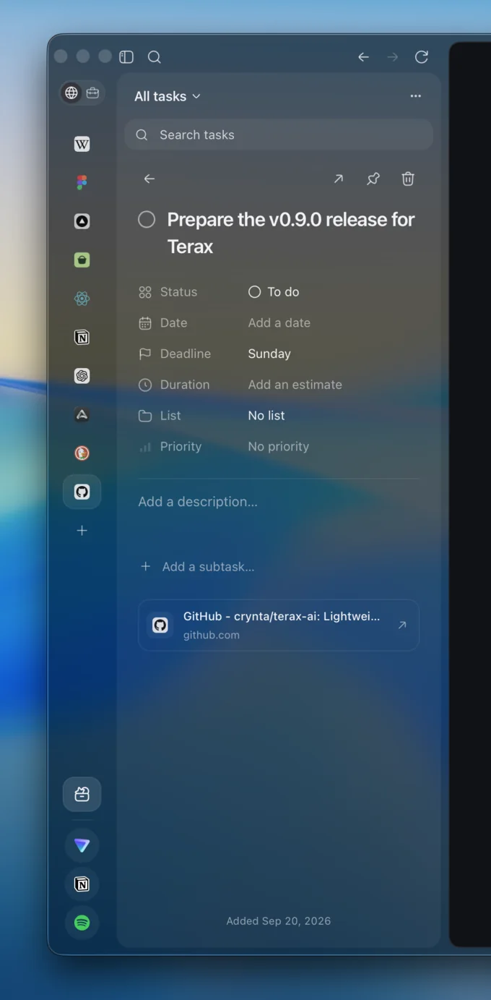
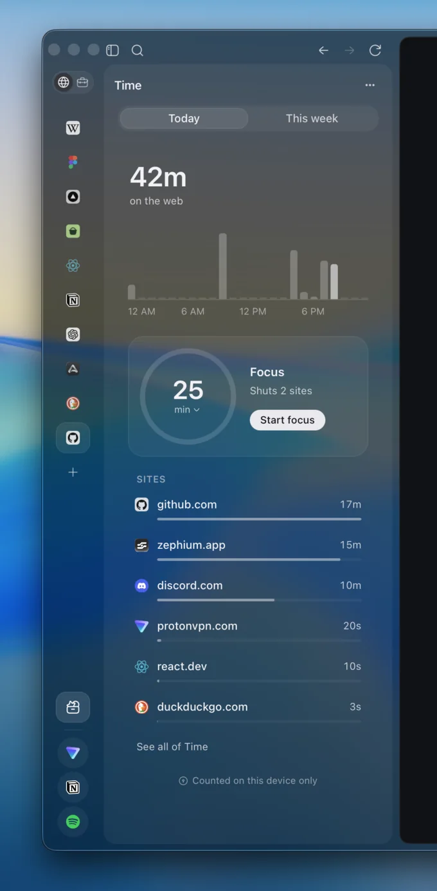
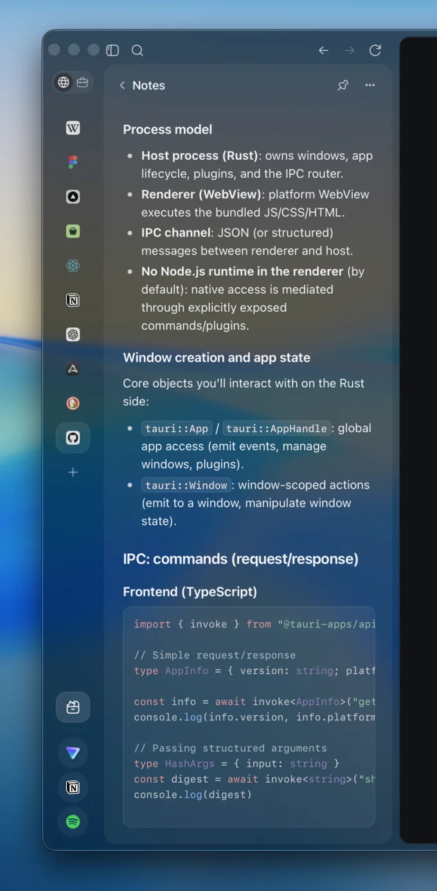

<div align="center">
  
  <h1>Zephium</h1>

  <p><strong>A fast, fully featured browser.<br />A work environment rebuilt for you and your agents.</strong></p>

  <p>
    <a href="https://zephium.app">Website</a>
    ·
    <a href="https://github.com/zephium-browser/Zephium/releases/latest">Download</a>
    ·
    <a href="docs/README.md">Docs</a>
    ·
    <a href="https://discord.gg/tyveTUyEp7">Discord</a>
  </p>

  <p>
    <a href="https://github.com/zephium-browser/Zephium/releases"></a>
    <a href="LICENSE"></a>
    
    <a href="https://discord.gg/tyveTUyEp7"></a>
    <a href="https://www.youtube.com/@crynta"></a>
  </p>
</div>

<p align="center">
  <a href="docs/readme/README.zh-CN.md">简体中文</a> |
  <a href="docs/readme/README.es.md">Español</a> |
  <a href="docs/readme/README.de.md">Deutsch</a> |
  <a href="docs/readme/README.fr.md">Français</a> |
  <a href="docs/readme/README.ja.md">日本語</a> |
  <a href="docs/readme/README.ko.md">한국어</a> |
  <a href="docs/readme/README.pt-BR.md">Português</a> |
  <a href="docs/readme/README.pl.md">Polski</a> |
  <a href="docs/readme/README.ru.md">Русский</a> |
  <a href="docs/readme/README.id.md">Bahasa Indonesia</a> |
  <a href="docs/readme/README.hi.md">हिन्दी</a>
</p>

<p align="center">
  
</p>

<p align="center">
  <strong>Safari's efficiency. Brave's protection. Arc's design.</strong><br />
  And <strong>Work</strong>, a canvas where your agents do real work in plain sight.
</p>

---

Zephium is an open-source browser built in Rust on your operating system's own
web engine: WebKit on macOS, the engine Safari uses, and WebView2 on Windows. It
is not a fork of Chromium or Firefox. It blocks ads and trackers natively, runs
Chrome extensions, and puts tasks, notes and your time on the web one click
away. The download is about 30 MB.

One switch away is **Work**. Your work already happens in the browser, where
your tabs, logins and history are. Work brings agents there instead of asking
you to move somewhere else, and lets you watch them do it.

> [!NOTE]
> Zephium is in **beta**. It is ready for daily use and for feedback, and you
> may find rough edges. Please [report what you find](https://github.com/zephium-browser/Zephium/issues).

## Work

Describe an outcome in your own words: plan a trip, compare vendors, design a
system, fix a bug. Work takes it from there on a canvas, and you see every
step.

<p align="center">
  
</p>
<p align="center"><sub>Asked to compare hosting for an AI SaaS, Work reads the pricing pages, recommends a stack and draws the architecture.</sub></p>

- **It starts from what you already have.** Work recalls what it knows about
  you, searches your history when it helps, and loads the right skill for the
  job. Each step appears on the canvas as it happens.
- **Helpers work in parallel, in the open.** For a trip, one helper looks for
  flats while another checks visas and a third compares flights. They browse
  live pages you can watch, and any source opens in a pane beside the canvas.
- **Results stay on the canvas.** Comparisons, tables, charts, diagrams, plans,
  code and documents are laid out where you can read them. They are not lost in
  a chat scroll.
- **A plan becomes your day.** One click turns each step of a plan into a task
  linked back to the Work. Anything worth keeping can be saved as a note.
- **It reaches past the browser.** Work reads and edits the folders you grant,
  runs commands, and hands larger coding jobs to Claude Code or Codex. It
  connects to MCP servers such as Linear, Notion, Sentry, Stripe and Figma, and
  to command-line tools such as `gh`.
- **You stay in charge.** Anything that posts, merges or changes something
  waits for your OK.
- **Bring any model.** Use your own keys for Anthropic, OpenAI, Google Gemini,
  DeepSeek or OpenRouter, or run a model locally through Ollama, LM Studio or
  any OpenAI-compatible server. Keys live in your system keychain.

Work ships with 25 skills, including trip planning, research, compare and
choose, plan my day, fix a bug and weekly status. You can write your own.

## Browse

### Fast and light

- Native WebKit on macOS and WebView2 on Windows, so pages run on the engine
  your system already keeps up to date.
- Inactive tabs go to sleep and wake when you return, so memory stays low with
  many tabs open.
- A native ad and tracker blocker, on by default, built on Brave's
  [adblock-rust](https://github.com/brave/adblock-rust) with EasyList and
  EasyPrivacy. Requests are stopped before a page can make them, and you can
  hide anything else on a page with a click.

### Designed to live in

- Vertical tabs in a quiet sidebar, with spaces, profiles, pinned tabs, folders
  and split view.
- Liquid Glass on macOS 26 and Mica on Windows 11.
- A launcher on `⌘ ⇧ Space` (`Ctrl Shift Space` on Windows) reaches tabs,
  history, notes and commands from anywhere on your desktop. Anything you type
  there can become a task.
- Every keyboard shortcut can be changed.

### Extensions

Install extensions straight from the Chrome Web Store. Twenty popular ones are
verified to work well in Zephium and are a click away in the extension manager,
including 1Password, Bitwarden, Grammarly, DeepL, Dark Reader, Vimium,
SponsorBlock, Raindrop.io, Notion Web Clipper and Refined GitHub.

### Bring everything with you

The welcome flow imports from Chrome, Safari, Arc, Zen, Firefox, Brave and
Edge.

## Built in

<table>
  <tr>
    <td width="33%" align="center"></td>
    <td width="33%" align="center"></td>
    <td width="33%" align="center"></td>
  </tr>
  <tr>
    <td valign="top"><strong>Tasks</strong><br /><sub>Write them the way you would say them, like "call Anna tomorrow at 3". Lists, priorities, deadlines, subtasks, and the page you were on stays linked.</sub></td>
    <td valign="top"><strong>Time</strong><br /><sub>See where your time on the web goes, counted on this device only. Start a focus round and the sites you choose stay shut until the break.</sub></td>
    <td valign="top"><strong>Notes</strong><br /><sub>Notes beside the page, each a Markdown file you own. Edits from other apps show up in Zephium.</sub></td>
  </tr>
</table>

## Private by default

- **No telemetry.** Zephium has no analytics and collects nothing about how you
  browse.
- **No account needed.** History, tasks, notes, memory and time live on your
  device.
- **Few, known connections.** Besides the sites you visit, Zephium connects for
  app updates, filter list updates, search suggestions, extension installs, and
  the AI providers and MCP servers you choose.
- **Private windows keep nothing** once they close.

## Download

| Platform | Architecture | Installer | Requires |
| -------- | ------------ | --------- | -------- |
| macOS | Apple Silicon | [`Zephium-macOS-arm64.dmg`](https://github.com/zephium-browser/Zephium/releases/latest/download/Zephium-macOS-arm64.dmg) | macOS Sonoma 14 or later |
| Windows | x64 | [`Zephium-Windows-x64-setup.exe`](https://github.com/zephium-browser/Zephium/releases/latest/download/Zephium-Windows-x64-setup.exe) | Windows 10 or 11 |

Windows builds are not code-signed yet, so SmartScreen may show "Windows
protected your PC". Choose **More info**, then **Run anyway**. Signing is on
the way.

Zephium downloads updates in the background and installs them when you choose
**Relaunch to update**. All releases are on the
[releases page](https://github.com/zephium-browser/Zephium/releases).

## What's next

- Linux and Intel Macs.
- Code-signed Windows builds.
- Optional Zephium Cloud: hosted AI for Work, with a free tier to try it.
- More built-ins that replace heavy extensions, such as translation.

## Build from source

Prerequisites:

- [Rust](https://rustup.rs) through `rustup`. The toolchain pinned in
  [`rust-toolchain.toml`](rust-toolchain.toml) installs itself on first use.
- Node.js, at the version in [`.node-version`](.node-version).
- pnpm, through Corepack: `corepack enable`.
- The [Tauri prerequisites](https://v2.tauri.app/start/prerequisites/) for your
  platform: Xcode Command Line Tools on macOS, or the Microsoft C++ Build Tools
  and WebView2 on Windows.

```sh
git clone https://github.com/zephium-browser/Zephium.git
cd Zephium
pnpm install --frozen-lockfile
pnpm dev
```

Development builds use their own `app.zephium.dev` profile, so they do not
touch the data of an installed Zephium. Linux is not supported yet. See
[CONTRIBUTING.md](CONTRIBUTING.md) before opening a pull request.

## Architecture

- Untrusted pages run in raw native WebViews, apart from the privileged Svelte
  interface that draws the browser.
- A Rust core owns tabs, storage, the blocker, extensions and agents.
- Each profile has its own isolated website data and Zephium-owned history,
  session and favicon data.
- The network blocker is native and built on Brave's
  [adblock-rust](https://github.com/brave/adblock-rust).
- Narrow in-tree adapters for Tauri and Wry handle storage policy, WebView
  construction, callbacks and teardown.

Read more in [docs/architecture.md](docs/architecture.md) and
[docs/security-model.md](docs/security-model.md).

## Contributing

Zephium is maintained by one person with a clear product direction, so please
discuss larger changes before writing them. [CONTRIBUTING.md](CONTRIBUTING.md)
explains what gets merged and how. Questions and ideas are welcome on
[Discord](https://discord.gg/tyveTUyEp7).

## Security

Please report vulnerabilities privately, not in a public issue. See
[SECURITY.md](SECURITY.md).

## License

Zephium is licensed under the [Mozilla Public License 2.0](LICENSE).

The bundled EasyList and EasyPrivacy filter lists are used under
[CC BY-SA 3.0](assets/blocker-seed/v1/LICENSE-CC-BY-SA-3.0.txt); see
[the notice](assets/blocker-seed/v1/NOTICE) for attribution.

The Zephium name and logo are not licensed under the MPL.

## Acknowledgements

Zephium stands on [Tauri](https://tauri.app), [Wry](https://github.com/tauri-apps/wry),
Brave's [adblock-rust](https://github.com/brave/adblock-rust) and
[EasyList](https://easylist.to).
